# Configurable Chat History Context for RAG — Technical Walkthrough

## 1. Overview

This feature adds **persistent chat history with configurable context** to the Odoo → RAG pipeline. Previously, chat context lived only in FastAPI's in-memory sessions (volatile, lost on restart, TTL-based expiry). Now:

- **Odoo stores every chat message** in the database (`rag.chat.message` table)
- **Admins configure** how many previous messages to send as context (0–N)
- **Each chat request** bundles the last N messages alongside the new prompt
- **The RAG system** receives structured conversation history for accurate contextual responses

---

## 2. Architecture — Before vs After

### Before (In-Memory Only)


> [!WARNING]
> In-memory sessions were lost on FastAPI restart, Docker redeployment, or TTL expiry (default 5 min).

### After (Persistent + Configurable)


> [!TIP]
> Chat history now survives server restarts, Docker redeployments, and has no TTL expiry. The admin controls context depth via Settings.

---

## 3. Complete Request Lifecycle

```mermaid
sequenceDiagram
    participant U as 👤 User (Odoo Discuss)
    participant MC as mail_channel_inherit
    participant CFG as ir.config_parameter
    participant DB as rag.chat.message (DB)
    participant API as rag_api_client
    participant FA as FastAPI /rag/chat
    participant RAG as RAGService
    participant EMB as EmbeddingService
    participant VEC as VectorDB
    participant LLM as LLMService (Gemini)

    U->>MC: Send message in Discuss
    Note over MC: _notify_thread() intercepts

    MC->>MC: Extract prompt, patient_seq
    MC->>MC: Spawn background thread

    rect rgb(240, 249, 255)
        Note over MC,DB: Background Thread (_async_call_rag_api)
        MC->>CFG: Read context_message_limit
        CFG-->>MC: limit = 3 (default)

        MC->>DB: CREATE user message
        Note over DB: role="user", content=prompt

        MC->>DB: SEARCH last (limit+1) msgs
        DB-->>MC: Previous messages
        MC->>MC: Build chat_history[] (exclude current msg)

        MC->>API: chat(prompt, session_id, chat_history)
        API->>FA: POST /api/v1/rag/chat

        FA->>RAG: chat(prompt, chat_history, ...)
        RAG->>EMB: generate_embedding(prompt)
        EMB-->>RAG: query_embedding
        RAG->>VEC: search_similar(embedding)
        VEC-->>RAG: similar_docs[]
        RAG->>RAG: _build_context(docs)

        RAG->>LLM: generate_chat_answer(prompt, context, chat_history)
        Note over LLM: Builds structured prompt with:<br/>1. System instruction<br/>2. Medical context<br/>3. === Chat History ===<br/>4. New question
        LLM-->>RAG: response_text

        RAG-->>FA: RAGQueryResponse
        FA-->>API: JSON response
        API-->>MC: result dict

        MC->>DB: CREATE assistant message
        Note over DB: role="assistant", content=response

        MC->>U: Post formatted HTML response
    end
```



---

## 4. Component Architecture

```mermaid
graph TB
    subgraph "Odoo (rag_controller module)"
        SETTINGS["res.config.settings<br/>━━━━━━━━━━━━━━━━━<br/>• rag_api_url<br/>• rag_api_key<br/>• rag_bot_partner_id<br/>• <b>context_message_limit</b> ⭐"]
        MODEL["rag.chat.message ⭐<br/>━━━━━━━━━━━━━━━━━<br/>• channel_id (FK)<br/>• session_id (indexed)<br/>• role (user/assistant)<br/>• content (text)<br/>• patient_seq<br/>• create_date (auto)"]
        MAIL["mail_channel_inherit<br/>━━━━━━━━━━━━━━━━━<br/>• _notify_thread()<br/>• _async_call_rag_api()<br/>• _post_rag_response()"]
        CLIENT["rag.api.client<br/>━━━━━━━━━━━━━━━━━<br/>• chat(prompt, session_id,<br/>  patient_seq, <b>chat_history</b>)"]
        CTRL["controllers/main.py<br/>━━━━━━━━━━━━━━━━━<br/>• /api/rag/chat"]
    end

    subgraph "FastAPI (RAG App)"
        SCHEMA["ChatRequest<br/>━━━━━━━━━━━━━━━━━<br/>• prompt<br/>• session_id<br/>• patient_seq<br/>• reset<br/>• <b>chat_history</b> ⭐"]
        RAGSVC["RAGService<br/>━━━━━━━━━━━━━━━━━<br/>• chat()"]
        LLMSVC["LLMService<br/>━━━━━━━━━━━━━━━━━<br/>• generate_chat_answer()"]
    end

    MAIL -->|reads| SETTINGS
    MAIL -->|reads/writes| MODEL
    MAIL -->|calls| CLIENT
    CLIENT -->|HTTP POST| SCHEMA
    CTRL -->|calls| CLIENT
    SCHEMA --> RAGSVC
    RAGSVC --> LLMSVC

    style MODEL fill:#51cf66,color:#fff
    style SETTINGS fill:#339af0,color:#fff
    style SCHEMA fill:#ffd43b,color:#333
```



---

## 5. Database Schema

### `rag_chat_message` Table

```sql
CREATE TABLE rag_chat_message (
    id          SERIAL PRIMARY KEY,
    channel_id  INTEGER REFERENCES mail_channel(id) ON DELETE CASCADE,
    session_id  VARCHAR NOT NULL,          -- e.g. "odoo_channel_42"
    role        VARCHAR NOT NULL,          -- 'user' or 'assistant'
    content     TEXT NOT NULL,             -- raw message text
    patient_seq VARCHAR,                   -- e.g. "20250800494012"
    create_date TIMESTAMP DEFAULT NOW(),   -- auto-populated
    write_date  TIMESTAMP DEFAULT NOW()
);

CREATE INDEX idx_rag_chat_session ON rag_chat_message(session_id);
CREATE INDEX idx_rag_chat_channel ON rag_chat_message(channel_id);
```

### Example Data

| id | session_id | role | content | patient_seq | create_date |
|----|-----------|------|---------|-------------|-------------|
| 1 | odoo_channel_42 | user | has fainted give me history | 20250800494012 | 2026-02-26 21:10:00 |
| 2 | odoo_channel_42 | assistant | Based on the patient's records... | 20250800494012 | 2026-02-26 21:10:05 |
| 3 | odoo_channel_42 | user | suggest fast aid | 20250800494012 | 2026-02-26 21:11:00 |
| 4 | odoo_channel_42 | assistant | Given the fainting episode... | 20250800494012 | 2026-02-26 21:11:04 |

---

## 6. Configuration Guide

### Setting Location

**Settings → Healthcare RAG Integration → Chat History Context Limit**

### Behavior Matrix

| `context_message_limit` Value | Behavior |
|-------------------------------|----------|
| **0** | No previous context sent. Each message is independent |
| **1** | Only the immediately preceding message is included |
| **3** (default) | Last 3 messages (mix of user + assistant) are sent as context |
| **5** | Last 5 messages for deeper conversation awareness |
| **10+** | Extended history — useful for complex multi-turn medical consultations |
| *empty/null* | Falls back to default of **3** |

### Config Parameter

The value is stored in `ir.config_parameter` as:
- **Key**: `rag_controller.context_message_limit`
- **Type**: String (parsed to integer)
- **Default**: `'3'`

---

## 7. LLM Prompt Structure

When `chat_history` is provided, the LLM receives a structured prompt:

```
System: You are a medical AI assistant. Answer questions based on the provided
medical context. Be precise, professional, and cite relevant information...

Medical Context:
[Document 1]
Patient 20250800494012 - Prescription PRE/2025/001
Complaints: Syncope (fainting), Dizziness
Vitals: BP 90/60, Pulse 48, SpO2 94%
...

=== Previous Conversation History ===
User: has fainted give me history
Assistant: Based on the patient's records, they have a history of syncope...
User: what medications are they on
Assistant: The patient is currently prescribed Metoprolol 25mg...
=== End of History ===

IMPORTANT: The above shows the previous conversation history.
Reference this history when answering the following new question.

New Question: suggest fast aid

Answer (referencing conversation history and medical context):
```

---

## 8. State Machine — Chat History Flow


---

## 9. File-by-File Changes

### New Files

#### ⭐ [rag_chat_message.py](file:///P:/RAG_healthcare/clidram/clidram-development/rag_controller/models/rag_chat_message.py)
New Odoo model `rag.chat.message` — persistent chat message storage with `session_id`, `role`, `content`, `patient_seq`, and `channel_id` fields. Ordered by `create_date asc` and indexed on `session_id` and `channel_id`.

#### ⭐ [ir.model.access.csv](file:///P:/RAG_healthcare/clidram/clidram-development/rag_controller/security/ir.model.access.csv)
Security access rules granting full CRUD to internal users (`base.group_user`) for `rag.chat.message`.

---

### Modified Files — Odoo Side

#### [res_config_settings.py](file:///P:/RAG_healthcare/clidram/clidram-development/rag_controller/models/res_config_settings.py)
```diff
+    context_message_limit = fields.Integer(
+        string='Chat History Context Limit',
+        config_parameter='rag_controller.context_message_limit',
+        default=3,
+        help='Number of previous chat messages to include as context...'
+    )
```

#### [res_config_settings_views.xml](file:///P:/RAG_healthcare/clidram/clidram-development/rag_controller/views/res_config_settings_views.xml)
```diff
+    <div class="col-xs-12 col-md-6 o_setting_box" id="rag_context_limit_config">
+        <label string="Chat History Context Limit" for="context_message_limit"/>
+        <div class="text-muted">
+            Number of previous chat messages to include as context...
+        </div>
+        <field name="context_message_limit" class="oe_inline"/>
+    </div>
```

#### [mail_channel_inherit.py](file:///P:/RAG_healthcare/clidram/clidram-development/rag_controller/models/mail_channel_inherit.py)
The `_async_call_rag_api()` method was enhanced with 5 new responsibilities:

1. **Read config** — fetches `context_message_limit` from `ir.config_parameter`
2. **Save user message** — creates `rag.chat.message` record with `role='user'`
3. **Fetch history** — queries last N+1 messages, excludes the current one, keeps N
4. **Build payload** — formats messages as `[{"role": "...", "content": "..."}]`
5. **Save assistant response** — creates `rag.chat.message` record with `role='assistant'`

#### [rag_api_client.py](file:///P:/RAG_healthcare/clidram/clidram-development/rag_controller/models/rag_api_client.py)
```diff
-    def chat(self, prompt, session_id, patient_seq=None, reset=False):
+    def chat(self, prompt, session_id, patient_seq=None, reset=False, chat_history=None):
         payload = { ... }
+        if chat_history:
+            payload["chat_history"] = chat_history
```

#### [main.py](file:///P:/RAG_healthcare/clidram/clidram-development/rag_controller/controllers/main.py) (controller)
```diff
-    def api_chat(self, prompt, session_id, patient_seq=None, reset=False, **kwargs):
+    def api_chat(self, prompt, session_id, patient_seq=None, reset=False, chat_history=None, **kwargs):
```

#### [__init__.py](file:///P:/RAG_healthcare/clidram/clidram-development/rag_controller/models/__init__.py) + [__manifest__.py](file:///P:/RAG_healthcare/clidram/clidram-development/rag_controller/__manifest__.py)
Added `rag_chat_message` import and `security/ir.model.access.csv` to manifest data.

---

### Modified Files — FastAPI Side

#### [schemas.py](file:///P:/RAG_healthcare/app/models/schemas.py)
```diff
 class ChatRequest(BaseModel):
+    chat_history: Optional[List[dict]] = Field(
+        default=None,
+        description="Optional: Previous chat messages as context..."
+    )
```

#### [rag.py](file:///P:/RAG_healthcare/app/api/v1/endpoints/rag.py)
```diff
     result = await rag.chat(
         ...
+        chat_history=request.chat_history,
     )
```

#### [rag_service.py](file:///P:/RAG_healthcare/app/services/rag_service.py)
- Added `chat_history` param to `chat()` signature
- Passes it through to `LLMService.generate_chat_answer()`
- Added `chat_history_length` to response metadata

#### [llm_service.py](file:///P:/RAG_healthcare/app/services/llm_service.py)
- Added `chat_history` param to `generate_chat_answer()`
- **New "Odoo-managed history" mode**: When `chat_history` is provided, builds a structured prompt with `=== Previous Conversation History ===` block
- Falls back to existing in-memory session behavior when no `chat_history` is provided (backward compatible)
- `context_preserved` now returns `True` when Odoo history is present

---

## 10. Deployment & Verification

### Step 1: Update Odoo Module
```bash
# Restart Odoo with module update
python odoo-bin -u rag_controller -d your_database
```

### Step 2: Verify Settings UI
Navigate to **Settings → Healthcare RAG Integration** and confirm:
- "Chat History Context Limit" field is visible
- Default value is **3**
- Field is editable

### Step 3: Test Chat Flow
1. Open Odoo Discuss → DM with RAG Bot
2. Send: `patient_id: 20250800494012 has fainted give me history`
3. Send follow-up: `suggest fast aid`
4. ✅ Second response should reference fainting from message 1

### Step 4: Verify Database Persistence
```sql
SELECT id, session_id, role, LEFT(content, 80) as content_preview,
       patient_seq, create_date
FROM rag_chat_message
ORDER BY create_date DESC
LIMIT 10;
```

### Step 5: Test Configuration
| Test | Action | Expected Result |
|------|--------|----------------|
| Default | Leave at 3, send 4+ messages | Last 3 included as context |
| No context | Set to 0 | Follow-ups have no prior awareness |
| Extended | Set to 10 | Up to 10 messages included |
| Empty field | Clear the field | Falls back to default of 3 |

### Step 6: Run Automated Test
```bash
cd P:\RAG_healthcare
python test_context_preservation.py
```
Expected: `context_preserved = True`, `message_count >= 2`
